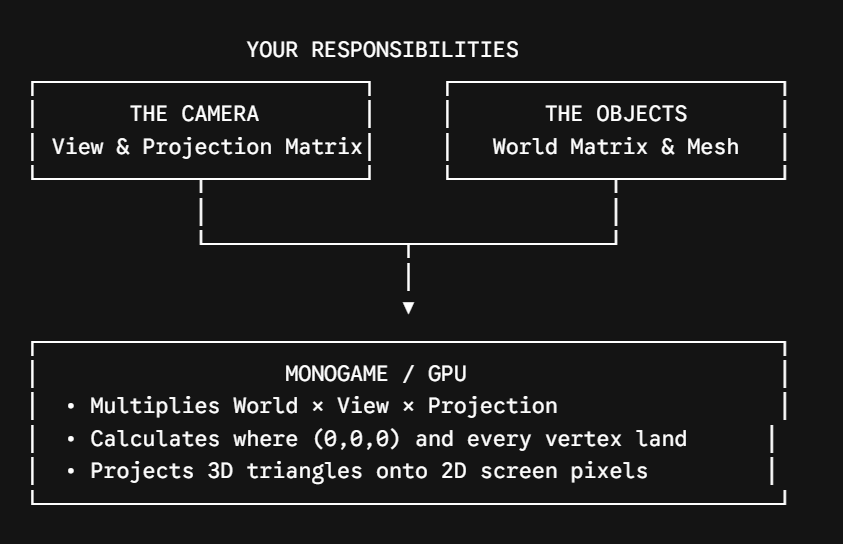

# Box Collider

Basic 3D game in monogame implementing following 3D concepts


## Coordinate system
* Z up coordinate system -> `+x` (right), `+z` (up) ,`+y` (towards viewer)

* coordinate spaces -> local space, global space (world matrix), camera space (view matrix), projection space (projection matrix)

* Local vertices -> vertices relative to object's 
origin which is already decided ; either by 
modelling software or by you

> ℹ️ Never determine x, y, z as left right up down as they can vary depending on the user convinence

## Buffers
* vertex buffer -> holds the vertices data that needs to be rendered


## Rendering
**complete chain**
```
World -> Where is the object?
View -> Where is it relative to the camera?
Projection -> How does the camera see/project it?
```
* non indexed rendering -> picking 3 vertices linearly at a time and forming triangle

* Transformations -> scale, rotation, translations


* Ensure -> texture format is set to color and generate minimaps is enabled in `mgcb editor`


## Camera controls
* `alt + lmb` -> rotate view
* `arrow keys` -> left, right, up, down
* `left control` -> move down in space
* `space` -> move up in space


## debug UI
* basic `Myra UI` setup to display debug info
* added via `Manage nuget packages`


## Rendering structure
